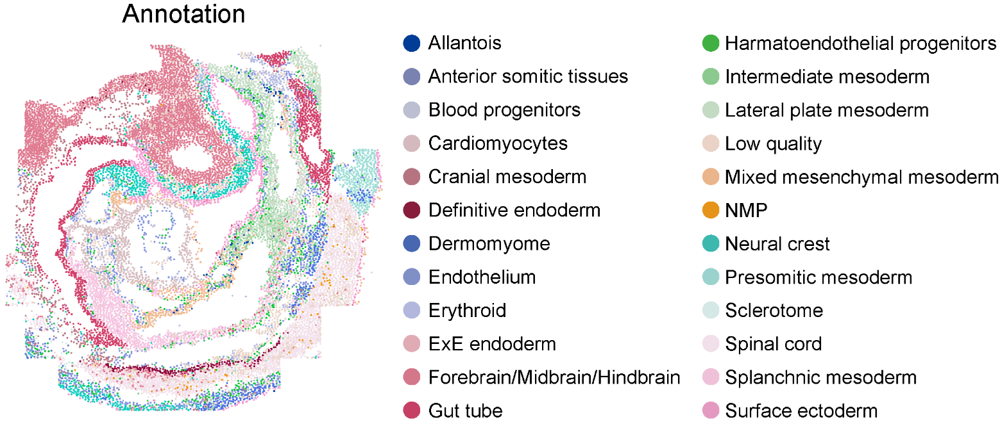
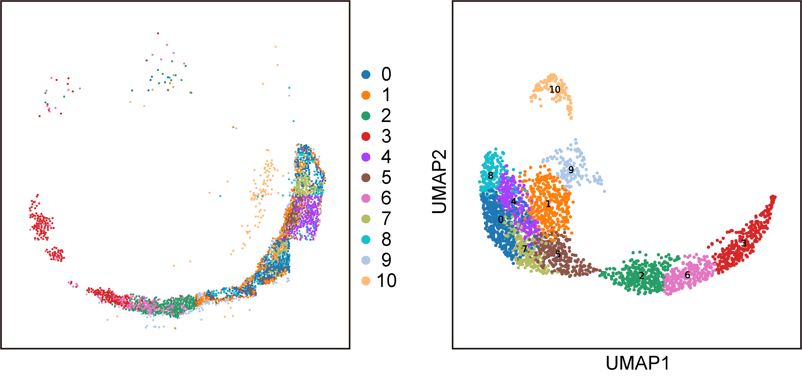
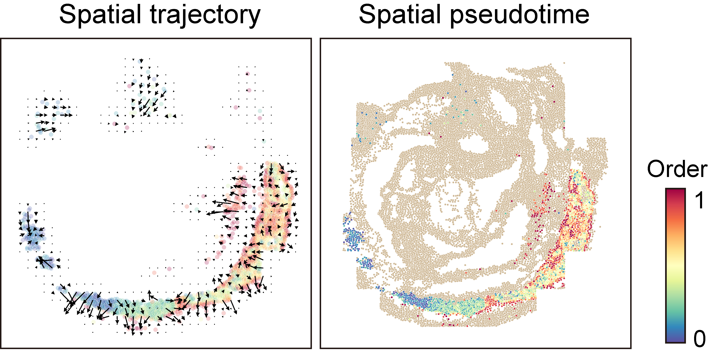
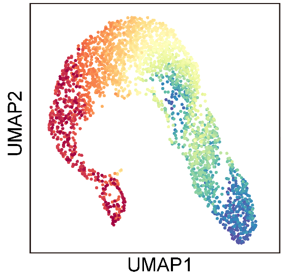

# Tutorial 1: Application on SeqFISH mouse embryo dataset. 
In this section, we will demonstrate the use of `DAGAST` on the [SeqFISH dataset(Lohoff, T. et al. 2022)](https://doi.org/10.1038/s41587-021-01006-2) for spatial trajectory inference and spatial pseudo-time calculation. The original data can be downloaded from the https://marionilab.cruk.cam.ac.uk/SpatialMouseAtlas/, and the demonstration data uses Embryo1.

---

### 1.Load DAGAST and set path

    import os 
    import torch
    import numpy as np
    import pandas as pd
    import scanpy as sc
    import seaborn as sns
    import matplotlib.pyplot as plt
    from tqdm import tqdm

    import DAGAST as dt     # import DAGAST

    import warnings
    warnings.filterwarnings("ignore")
    torch.cuda.empty_cache()   

    ## version and path
    sample_name = "DAGAST"
    root_path = "/public3/Shigw/"
    data_folder = f"{root_path}/datasets/SeqFISH/"
    save_folder = f"{data_folder}/results/{sample_name}"
    dt.check_path(save_folder)

### 2.Set Hyperparameters 

    SEED = 24
    knn = 30
    n_neighbors = 9
    n_externs = 10

    dt.setup_seed(SEED)
    torch.cuda.empty_cache()     
    device = torch.device('cuda:1')
    args = {
        "num_input" : 351,  
        "num_emb" : 256,        # 256  512
        "dk_re" : 16,
        "nheads" : 1,               #  1    4
        "droprate" : 0.15,          #  0.25,
        "leakyalpha" : 0.15,        #  0.15,
        "resalpha" : 0.5, 
        "bntype" : "BatchNorm",     # LayerNorm BatchNorm
        "device" : device, 
        "info_type" : "nonlinear",  # nonlinear
        "iter_type" : "SCC",
        "iter_num" : 200,

        "neighbor_type" : "extern",
        "n_neighbors" : 9,
        "n_externs" : 10,

        "num_epoch1" : 1000, 
        "num_epoch2" : 1000, 
        "lr" : 0.001, 
        "update_interval" : 1, 
        "eps" : 1e-5,
        "scheduler" : None, 
        "SEED" : 24,

        "cutof" : 0.1,
        "alpha" : 1.0,
        "beta" : 0.1,
        "theta1" : 0.1,
        "theta2" : 0.1
    }

    celltypes = ['Spinal cord', 'NMP']      # target cell

### 3.load dataset

    st_data = sc.read_h5ad(data_folder + "/st_data.h5ad")
    sc.pp.normalize_total(st_data, target_sum=1e4)          
    sc.pp.log1p(st_data)
    sc.pp.scale(st_data)
    st_data_use = st_data[st_data.obs.celltypes.isin(celltypes), :].copy()   ## target data 

    ## show data
    dt.plot_spatial_complex(
        st_data, st_data_use, mode="cluster", key="celltypes",
        figsize=(5, 5), title=None, pointsize=5, 
        savename=f"{save_folder_cluster}/spatial_sel_cell.png"
    )

### 4.Build DAGAST, train DAGAST
#### 4.1 train_stage1
    save_folder_cluster = f"{save_folder}/2.spatial_cluster/"
    dt.check_path(save_folder_cluster)

    trainer = dt.DAGAST_Trainer(args, st_data, st_data_use) # Build DAGAST Trainer
    trainer.init_train()                                    # Build Model, neighbor
    trainer.train_stage1(f"{save_folder_cluster}/model_{sample_name}_stage1.pkl") 

#### 4.2 select start region
    ## Select starting area (available separately)
    model = torch.load(f"{save_folder_cluster}/model_{sample_name}_stage1.pkl")
    model.eval()
    emb = model.get_emb(isall=False)
    emb_adata = sc.AnnData(emb)
    emb_adata.obs['celltypes'] = st_data_use.obs['celltypes'].values
    sc.pp.neighbors(emb_adata, use_rep='X', n_neighbors=20)
    sc.tl.umap(emb_adata)
    sc.tl.leiden(emb_adata, resolution=1.0)         # res = 0.1
    print(f"{len(emb_adata.obs['leiden'].unique())} clusters")

    plt.close('all')
    fig = plt.figure(figsize=(10, 10))
    plt.subplot(1, 1, 1)
    ax = sc.pl.umap(emb_adata, color="leiden", color_map='Spectral_r', legend_loc='on data', legend_fontweight='normal')
    plt.savefig(f"{save_folder_cluster}/2.umap_cluster_stage1.pdf", dpi=600)

    st_data_use.obs['emb_cluster'] = emb_adata.obs['leiden'].values
    plt.close('all')
    plt.rcParams["figure.figsize"] = (5, 5)
    ax = sc.pl.embedding(st_data_use, basis="spatial", color="emb_cluster",size=15, s=10, show=False, title='clustering')
    plt.axis('off')
    plt.savefig(f"{save_folder_cluster}/2.spatial_cluster_stage1.pdf", dpi=600, bbox_inches='tight')

#### 4.3 train_stage2
    save_folder_trajectory = f"{save_folder}/3.spatial_trajectory/"
    dt.check_path(save_folder_trajectory)

    flag = (st_data_use.obs['emb_cluster'].isin(['3'])).values   

    trainer.set_start_region(flag)                                  # set start region
    trainer.train_stage2(save_folder_trajectory, sample_name)       # Trajectory inference
    trainer.get_Trajectory_Ptime(knn, grid_num=50, smooth=0.5, density=0.7) 

### 5.Display results

    st_data, st_data_use = trainer.st_data, trainer.st_data_use
    model = trainer.model

    xy1 = st_data.obsm['spatial']
    xy2 = st_data_use.obsm['spatial']

#### 5.1 Space trajectory map
    plt.close('all')
    fig, axs = plt.subplots(figsize=(5, 5))
    sns.scatterplot(x = xy2[:, 0], y = xy2[:, 1], marker = 'o', c = st_data_use.obs['ptime'], s=20, cmap='Spectral_r', legend = False, alpha=0.25)
    axs.quiver(st_data_use.uns['E_grid'][0], st_data_use.uns['E_grid'][1], st_data_use.uns['V_grid'][0], st_data_use.uns['V_grid'][1], 
        scale=0.2, linewidths=4, headwidth=5)
    plt.savefig(f"{save_folder_trajectory}/1.spatial_quiver.pdf", format='pdf',bbox_inches='tight')

#### 5.2 Spatial pseudo-time
    dt.plot_spatial_complex(
        st_data, st_data_use, mode="time",
        value=st_data_use.obs['ptime'], title="ptime", pointsize=5,
        savename=f"{save_folder_trajectory}/2.spatial_Pseudotime.pdf"
    )

#### 5.3 UMAP of features
    model.eval()
    emb = model.get_emb(isall=False)
    adata = sc.AnnData(emb)
    sc.pp.neighbors(adata, use_rep='X', n_neighbors=knn)
    adata.obs['ptime'] = st_data_use.obs['ptime'].values
    adata.obs['celltypes'] = st_data_use.obs['celltypes'].values
    sc.tl.umap(adata)

    plt.close('all')
    fig = plt.figure(figsize=(10, 10))
    plt.subplot(1, 1, 1)
    ax = sc.pl.umap(adata, color="ptime", color_map='Spectral_r')
    plt.savefig(f"{save_folder_trajectory}/3.umap_ptime.pdf")

---

